# FB_prophet_ARIMA_anomaly_detection

Anomaly detection using Facebook Prophet and ARIMA methods.

# Dataset

This dataset contains sales data in Walmart stores. Data has 421570 rows and 16 columns.

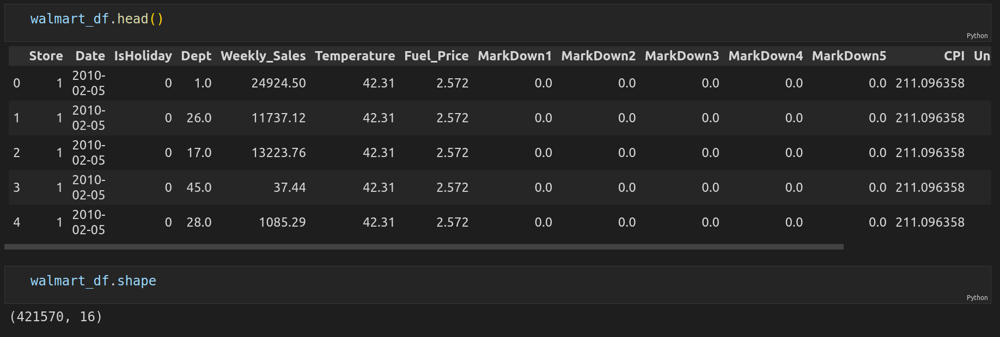

In this project we will use only Weekly Sales for Store 1.

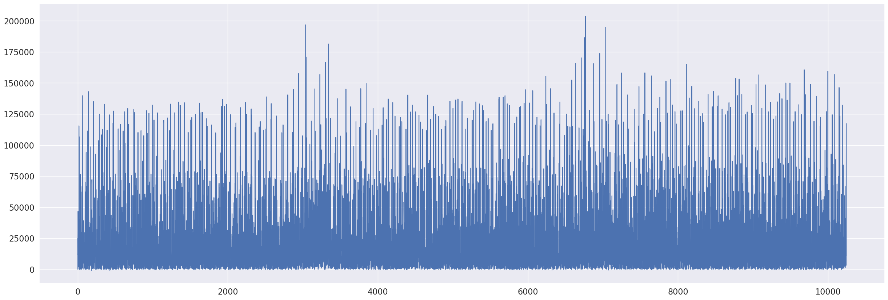

# Resample Data

We will resample data by day and take the mean values. Below is a plot of resampled dataset.

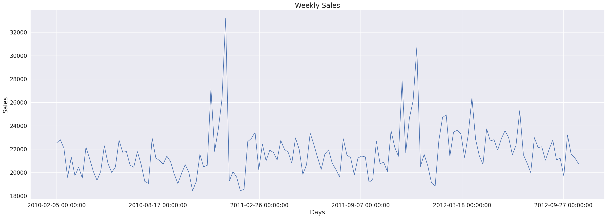

# Autocorrelation and Partial Autocorrelation

Plot autocorrelation and partial autocorrelation.

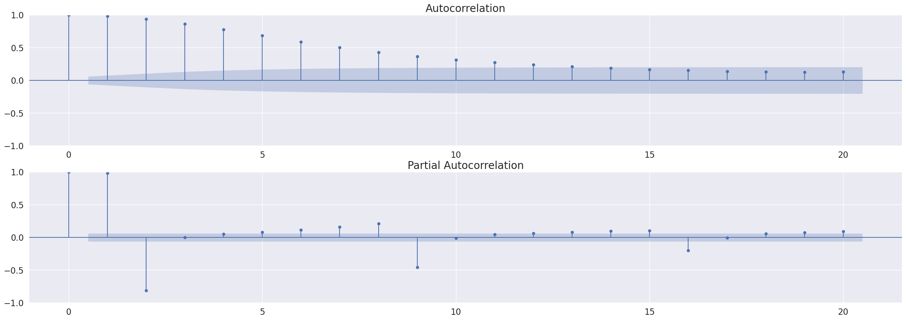

# Holiday Events

We have information about holiday events that we can use in Prophet model.

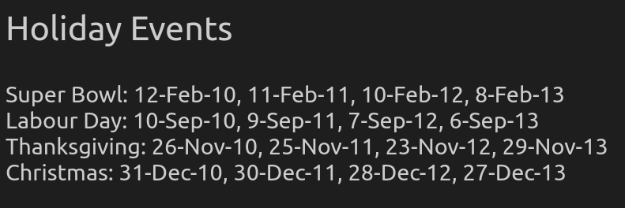

Let's create a table that we will pass to the model.

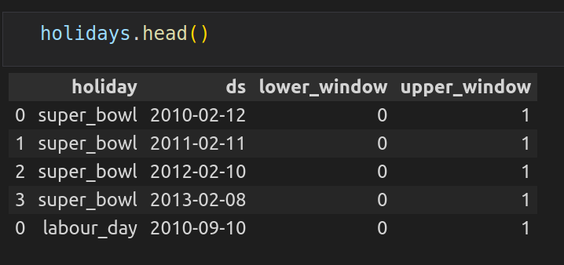

# Train Dataset

Let's create train dataset.

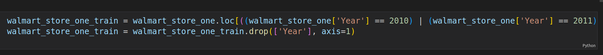

# Prophet Model

Let's train the model with the following parameters.

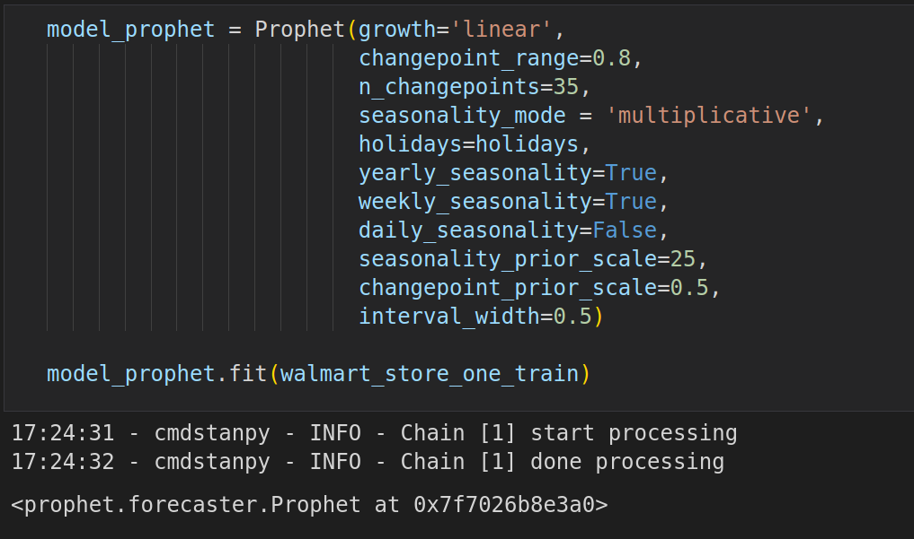

And then make a prediction with our model.

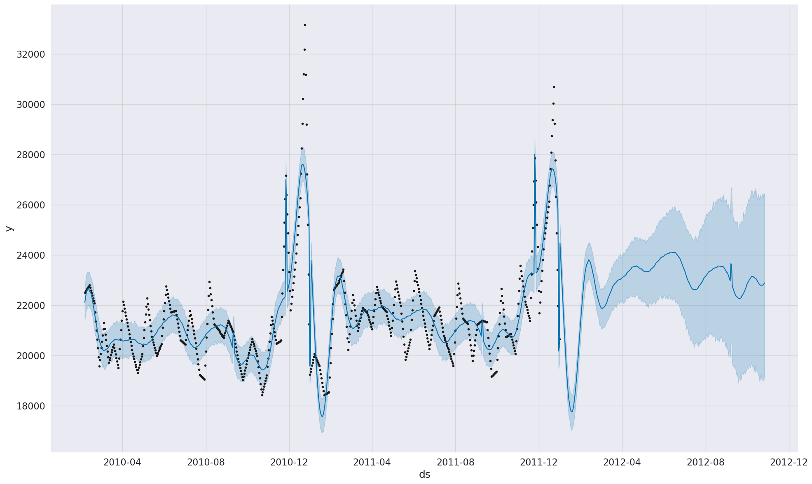

# Anomaly Detection

To detect anomalies we need to calculate our model's errors and confidence intervals. If error is bigger than 1.5*(uncertanity) that is anomaly.

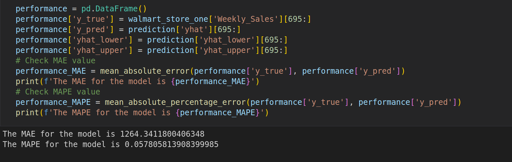

We can see that we have 8 anomalies in our data.

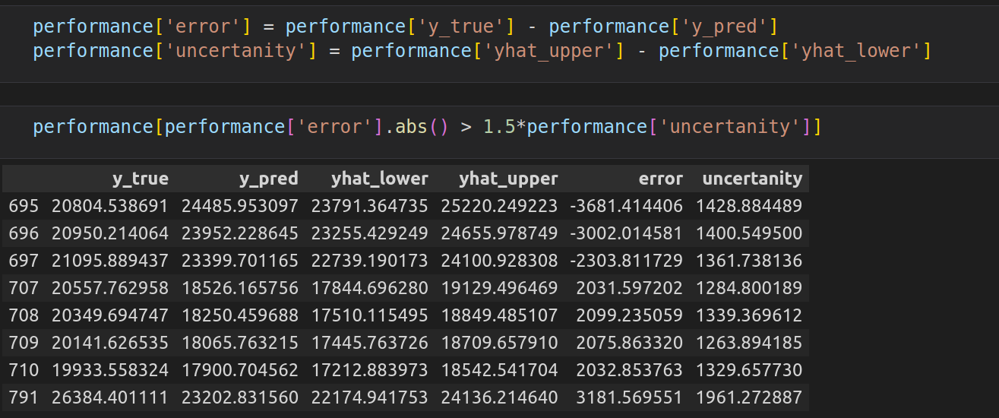

Let's plot anomaly observations.

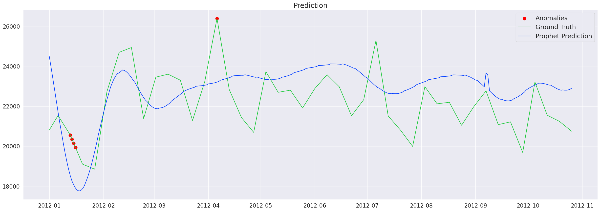

# ARIMA model

# Split the data

Let's split the data and set the parameters of ARIMA model.

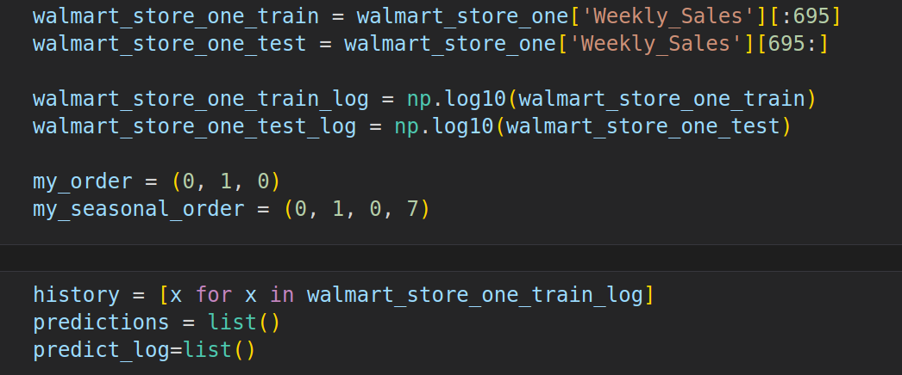

# ARIMA Training

Now let's train our model.

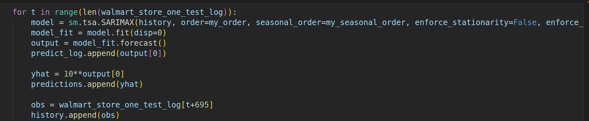

After training is over we can make a prediction and plot it.

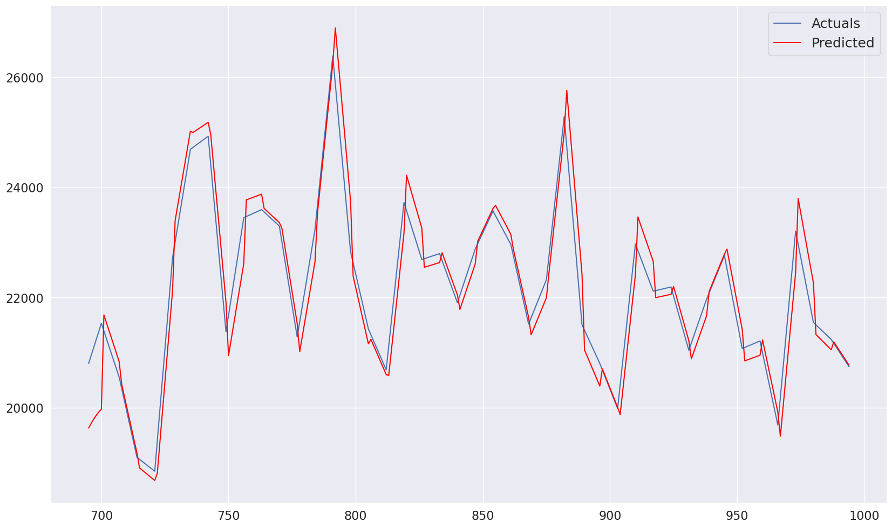

# Anomaly Detection

To detect anomalies we need to calculate our model's errors and confidence intervals.

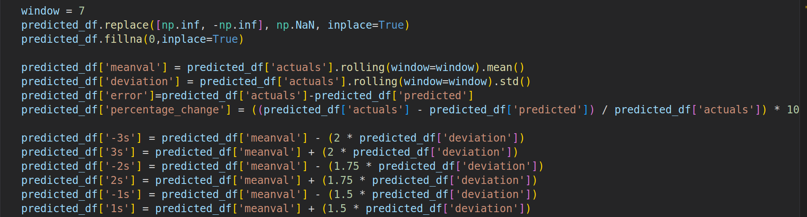

If error is bigger than 1.5*(uncertanity) that is anomaly.

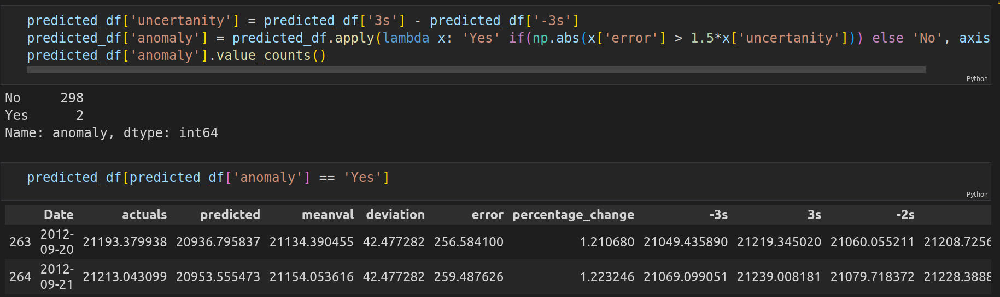

ARIMA model found two anomalies in our data. Let's plot it.

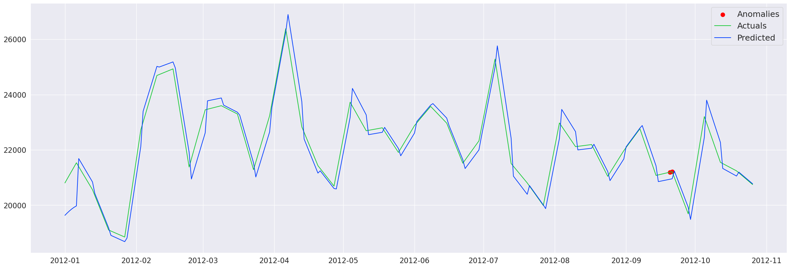
